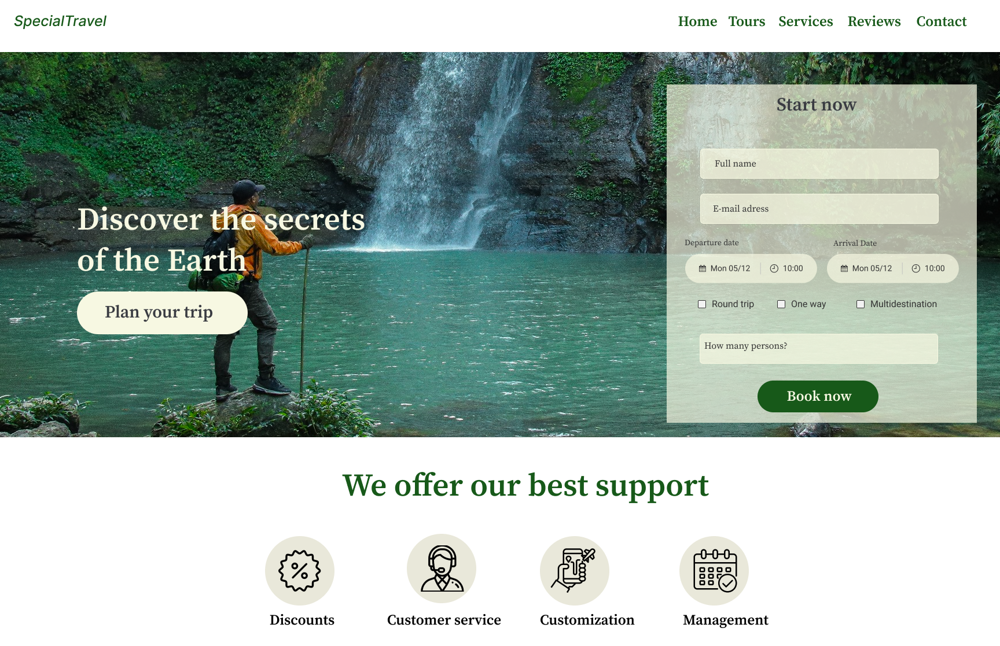

# Advanced HTML and CSS Review

for this lab you are required to design a simple login page and you are required to css in this challenge.

## helpful tips
- try to map the layout first then start coding.

- think about the different components that you'll use during this lab.

figma link:[here](https://www.figma.com/file/ohwoI5Uk2FV2M4aKsVaYHk/Tourism-Landing-Page-(Community)?node-id=0%3A1)

Happy Coding.